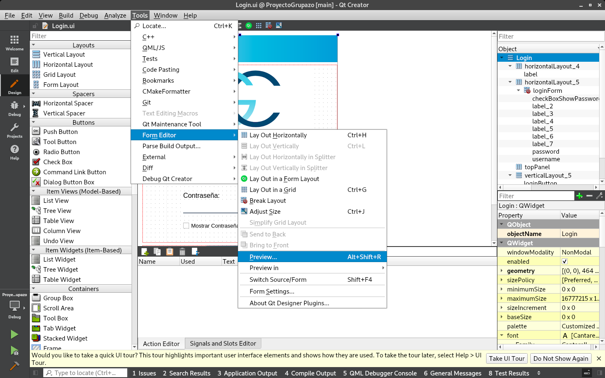

# PI_Grupazo

## Visualizacion de ventanas en QT (Instrucciones)

1. Abrir la carpeta PI_Grupazo/ProyectoGrupazo y luego dar doble click en el archivo `ProyectoGrupazo.pro`.

2. Seleccionar y abrir el archivo .ui en la carpeta Forms (Ej: Login.ui, Usuario Solicitudes.ui… ).

3. Ir a la barra de menú y luego seleccionar `Tools/FormEditor/Preview...`

